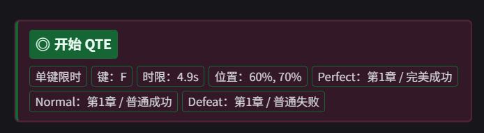
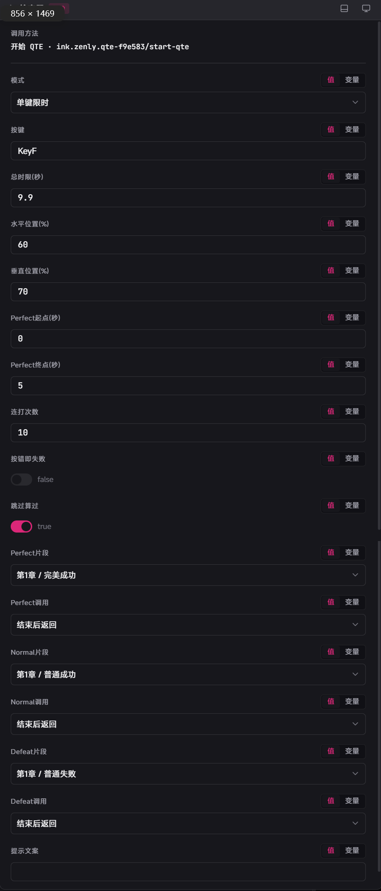
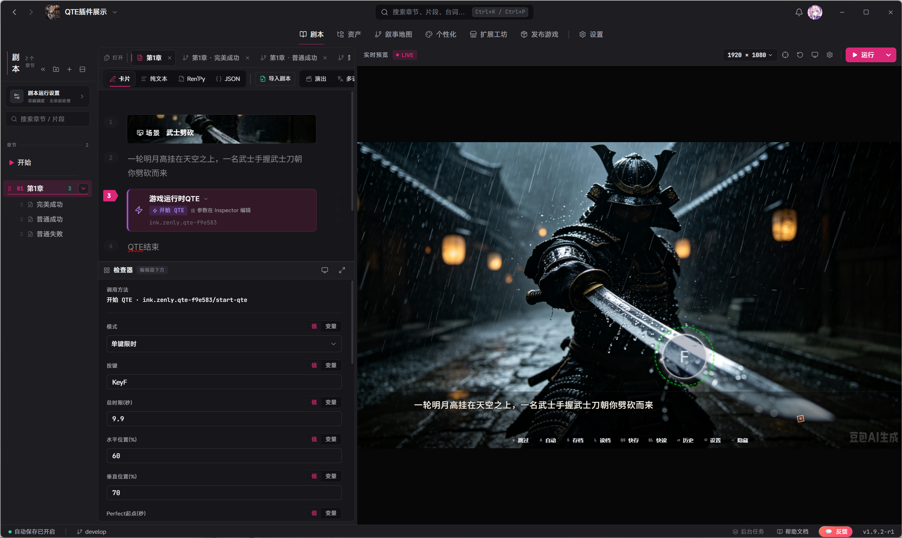

# LetsGal Studio 游戏运行时 QTE

> 扩展包 ID：`ink.zenly.qte-f9e583`｜ 程序界面：`qte`、`qte-editor`  
> 扩展版本：`1.0.0` ｜ 需要 LetsGal Studio SDK：`>=1.9.2-beta`

这是一个**游戏里的限时按键挑战（QTE）**：剧情调用后弹出双环按钮，玩家在时限内按对键（或连打够次数），按结果跳到 Perfect / Normal / Defeat 对应片段。

本文只讲**作者怎么在 Studio 里用这个扩展**。  
若要改扩展源码或二次开发，请直接阅读仓库 [`src/`](src/) 下的模块注释。

## 目录

1. [这个扩展能做什么](#1-这个扩展能做什么)
2. [安装与构建](#2-安装与构建)
3. [五分钟做出第一次能用的 QTE](#3-五分钟做出第一次能用的-qte)
4. [什么时候出现、怎么触发](#4-什么时候出现怎么触发)
5. [作者设置：外观与尺寸](#5-作者设置外观与尺寸)
6. [样式可视化编辑器](#6-样式可视化编辑器)
7. [剧情参数：模式、位置、结果片段](#7-剧情参数模式位置结果片段)
8. [玩家能不能自己改](#8-玩家能不能自己改)
9. [判定结果怎么算](#9-判定结果怎么算)
10. [用哪种 Preview、改完没生效怎么办](#10-用哪种-preview改完没生效怎么办)
11. [自检清单与常见问题](#11-自检清单与常见问题)
12. [更新日志](#12-更新日志)

## 1. 这个扩展能做什么

**可以：**

- **单键限时**：在倒计时内按下指定键；落在 Perfect 时间窗内算 Perfect，否则算 Normal
- **连打**：在时限内连按指定次数；在 Perfect 窗内凑齐次数算 Perfect
- 用 `posX` / `posY`（舞台百分比）单独摆每次 QTE 的位置
- Perfect / Normal / Defeat 各绑一个片段；可选「播完返回」或「不返回（切断）」
- 项目级统一皮肤：外环 / Perfect 环 / 按钮 / 闪光颜色与尺寸
- 用 **QTE样式编辑器** 可视化改皮肤，与扩展设置同一套数据

**暂时做不到 / 要注意：**

- 不负责拖拽摆布局；每次位置只在调用方法里用百分比填写
- 样式编辑器**不会**改玩法参数，也**不会**在预览里真正跳转片段
- 按键可从 A–Z 预设中选；不在预设里的用「自定义键盘码」（如 `Space`），**自定义优先**
- 玩家不能在游戏里自己改 QTE 皮肤（皮肤只听作者项目设置）

## 2. 安装与构建

需要：Node.js，以及 Studio SDK `>=1.9.2-beta`。

在扩展根目录执行：

```powershell
npm install
npm run build
```

（若仓库有 `pnpm-lock.yaml`，也可用 `pnpm install`。）

Studio 会加载 `extension.json` 里写的 `dist/index.mjs`。  
改完源码后：先 `build`（或开着 `npm run watch`），再在 Studio 里重载扩展；不行就重启 Preview。

## 3. 五分钟做出第一次能用的 QTE

跟着做一遍，就能验证「调用 → 弹出 → 按键 → 跳片段」。

### 第一步：准备三个结果片段（可选但推荐）

在同一章（或你要跳去的章节）里准备例如：

| 片段用途 | 建议内容 |
| --- | --- |
| Perfect | 「太棒了」对话 |
| Normal | 「勉强过关」对话 |
| Defeat | 「失败了」对话 |

不绑片段也能弹出 QTE，只是结束后不会自动跳剧情。

### 第二步：在剧情里加「开始 QTE」





在需要挑战的节点加 Action：

1. 类型：**调用方法**
2. 扩展：`ink.zenly.qte-f9e583`
3. 方法：**开始 QTE**（`start-qte`）

最少可先这样填：

| 参数 | 示例 |
| --- | --- |
| 模式 | `单键限时` |
| 按键 | `F`（下拉预设） |
| 总时限(秒) | `5` |
| 水平位置(%) | `50` |
| 垂直位置(%) | `50` |
| Perfect片段 / Normal片段 / Defeat片段 | 选上一步的片段 |

### 第三步：用剧本 Preview 试玩



跑**剧本 Preview**，播到该 Action：

1. 舞台上应出现双环 + 中心按键提示
2. 在时限内按 `F`（或你填的键）
3. 应跳到对应结果片段

## 4. 什么时候出现、怎么触发

可以把它想成：

```text
剧情执行「开始 QTE」（start-qte）
  ├─ 舞台弹出覆盖层（位置由 posX/posY 决定）
  ├─ 玩家按对键 / 连打 / 超时 / 跳过
  └─ 按结果跳 Perfect / Normal / Defeat 片段（若已配置）
```

| 程序界面 | 干什么 |
| --- | --- |
| `qte` | 运行时覆盖层 + 方法 `start-qte` + 项目样式设置 |
| `qte-editor` | Studio 里的「QTE样式编辑器」，只改皮肤，不参与剧本调用 |

QTE **不会**常驻挂着；只有执行到 `start-qte` 时才会出现，结算后关闭。

## 5. 作者设置：外观与尺寸

路径：Studio → 扩展 / 项目设置 → **QTE**（程序界面 `qte`）。

这些是**整份项目的默认皮肤**，之后每次 `start-qte` 都会用。高级样式被分为八组：

| 分组 | 可以修改 |
| --- | --- |
| 背景 | 全屏遮罩颜色、透明度、背景模糊、环境辉光 |
| 计时环 | 主环/轨道颜色、圆形/圆角方形/菱形、实线/虚线/分段、尺寸、描边、辉光、旋转 |
| 刻度 | 颜色、数量、长度 |
| Perfect | 判定窗口环颜色与动态高亮 |
| 按键 | 底色、文字、描边、强调色、形状、尺寸、字号、阴影、呼吸 |
| 文案 | 文字/底色、字重、字号、距离、字距、内边距、圆角 |
| 进度 | 隐藏/秒数/百分比、颜色、字号、距离；连打模式始终显示命中数 |
| 特效 | 命中闪光颜色、尺寸、强度、持续时间、光点数量、统一动效倍率 |

旧项目只保存了原来的 8 个字段也可以直接打开；新增字段会自动使用经典样式默认值。

> 位置不要在这里找：`posX` / `posY` 是**每次调用**的方法参数，不是项目设置。

## 6. 样式可视化编辑器

程序界面：`qte-editor`，Studio 里显示为 **QTE样式编辑器**。

### 打开方式

1. 打开目标项目  
2. 进入扩展程序 UI / 模块列表  
3. 打开 **QTE样式编辑器**（与 **QTE** 并列）

### 编辑器布局

- 左：**8 套内置预设**，可按基础 / 动作 / 幻想 / 氛围筛选
- 中：**运行时同源实时舞台**，支持倒计时播放、拖动时间轴、单键/连打、命中反馈、背景与速度切换
- 右：**8 个视觉图层**，集中编辑 40 余项颜色、结构、排版与动效参数
- 顶部：撤销、重做、恢复经典样式、完整 JSON 导入/导出

参数修改和预设切换都会自动写入 `qte` 模块的项目设置，与上一节「作者设置」**同一套数据**。编辑器画布直接复用游戏里的 `QteVisual`，不是另一份近似效果。

> 样式实验室不会真正调用 `start-qte`，也不会跳转剧本片段；剧情分支仍应在剧本 Preview 中验证。

### 编辑器不管什么

- 不管按键、时限、连打次数  
- 不管 Perfect / Normal / Defeat 片段  
- 不管 `posX` / `posY` 摆放  

这些仍在剧本「开始 QTE」参数里配置。

## 7. 剧情参数：模式、位置、结果片段

Action：**调用方法** → 扩展 `ink.zenly.qte-f9e583` → **开始 QTE**（`start-qte`）。

### 常用参数

| 参数 | 类型 | 必填 | 默认 | 说明 |
| --- | --- | --- | --- | --- |
| 模式 `mode` | 枚举 | 否 | `single` | `single` 单键限时；`mash` 连打 |
| 按键 `key` | 枚举 | 是 | `KeyF` | 预设 **A–Z**（值为 `KeyA`…`KeyZ`） |
| 自定义键盘码 `customKeyCode` | 字符串 | 否 | 空 | 如 `Space`、`Digit1`、`Enter`；**非空时优先于按键预设** |
| 总时限(秒) `timeoutSec` | 数字 | 是 | `5` | 最小 `0.1` |
| 水平位置(%) `posX` | 数字 | 否 | `50` | 舞台宽度 0–100，`50`=水平居中 |
| 垂直位置(%) `posY` | 数字 | 否 | `50` | 舞台高度 0–100，`50`=垂直居中 |
| Perfect起点(秒) | 数字 | 否 | `0` | Perfect 时间窗起点 |
| Perfect终点(秒) | 数字 | 否 | `1` | Perfect 时间窗终点 |
| 连打次数 `mashCount` | 数字 | 否 | `10` | 仅连打模式，最小 `1` |
| 按错即失败 | 开关 | 否 | 关 | 开了之后按错键立刻 Defeat |
| 跳过算过 | 开关 | 否 | 开 | 开=跳过当 Normal；关=跳过当 Defeat |
| Perfect / Normal / Defeat 片段 | 片段 | 否 | - | 结算后跳转的目标 |
| Perfect / Normal / Defeat 调用 | 枚举 | 否 | `return` | `return` 播完返回；`goto` 不返回（切断） |
| 提示文案 `prompt` | 字符串 | 否 | - | 覆盖层顶部提示 |

> 片段参数会自动带上所属章节信息，一般**不用**手填章节 id。

### 位置怎么理解

- `(50, 50)`：大致屏幕中央  
- `(20, 70)`：偏左下  
- 每次调用可以摆不同位置；样式（颜色/尺寸）仍用项目统一皮肤  

## 8. 玩家能不能自己改

**不能。**  
皮肤与尺寸只听作者的项目设置 / 样式编辑器；玩家游玩时无法自行换色或改直径。

玩家能做的只有：在时限内按键、连打，或（若宿主提供）跳过——跳过结果由「跳过算过」开关决定。

## 9. 判定结果怎么算

| 结果 | 典型情况 |
| --- | --- |
| **Perfect** | 单键：在 Perfect 时间窗内按下正确键；连打：在窗内凑齐次数 |
| **Normal** | 时限内完成，但不在 Perfect 窗内；或跳过且「跳过算过」为开 |
| **Defeat** | 超时；按错且「按错即失败」为开；或跳过且「跳过算过」为关 |

结算后若配置了对应片段，会按该结果的「调用」方式跳转（返回 / 切断）。

## 10. 用哪种 Preview、改完没生效怎么办

| 你改了什么 | 建议怎么验 |
| --- | --- |
| `start-qte` 参数、片段跳转 | **剧本 Preview**，播到该 Action |
| 扩展设置里的颜色 / 尺寸 | 改完保存 → 再跑剧本 Preview 触发一次 QTE |
| 样式编辑器 | 设计页看画布；真机观感仍以剧本 Preview 的 `start-qte` 为准 |
| 扩展源码 | `npm run build` 或 `npm run watch` → Studio 重载扩展 |

**改完没生效时依次试：**

1. 确认加载的是本扩展包 `ink.zenly.qte-f9e583`  
2. 源码改过的话先 `build`，确认 `dist/index.mjs` 已更新  
3. Studio 重载扩展 / 重启 Preview  
4. 样式：确认改的是 **QTE** 设置（或样式编辑器），不是别的扩展  
5. 位置不对：查该次调用的 `posX` / `posY`，不是项目设置  

## 11. 自检清单与常见问题

### 自检清单

- [ ] 扩展已加载，版本与 SDK 满足头部要求  
- [ ] 剧本里有「开始 QTE」，按键与时限已填  
- [ ] Preview 能弹出双环，按键有反应  
- [ ] Perfect / Normal / Defeat 片段跳转符合预期  
- [ ] （可选）样式编辑器改色后，设置面板与真开 QTE 一致  
- [ ] （可选）`posX` / `posY` 摆位正确  

### 常见问题

**Q：界面出来了，但按键没反应？**  
A：先确认「按键」预设或「自定义键盘码」是否正确（自定义优先）。自定义请填键盘码（如 `Space`、`Digit1`），并在 Preview 窗口处于焦点时按键。

**Q：想用空格 / 数字键？**  
A：在「自定义键盘码」填 `Space` 或 `Digit0`…`Digit9`；不要只依赖 A–Z 预设。

**Q：样式编辑器预览里怎么不跳片段？**  
A：正常。预览页只演示动画，不跑真实会话；跳片段请用剧本 Preview + `start-qte`。

**Q：改了颜色，游戏里还是旧的？**  
A：确认改的是本扩展 **QTE** 设置；保存后重新触发一次 QTE；必要时重载扩展。

**Q：想每次 QTE 颜色不同？**  
A：当前版本皮肤是项目级统一的；每次调用只能改位置与玩法参数，不能按次换皮。

**Q：连打一直 Defeat？**  
A：检查 `mashCount`、总时限，以及 Perfect 时间窗是否过短。

## 12. 更新日志

### 1.0.0

- 单键限时 / 连打两种模式  
- Perfect / Normal / Defeat 片段跳转（返回 / 切断）  
- `posX` / `posY` 百分比定位  
- 项目级样式设置  
- QTE样式编辑器（设计 / 预览，与设置同步）  
